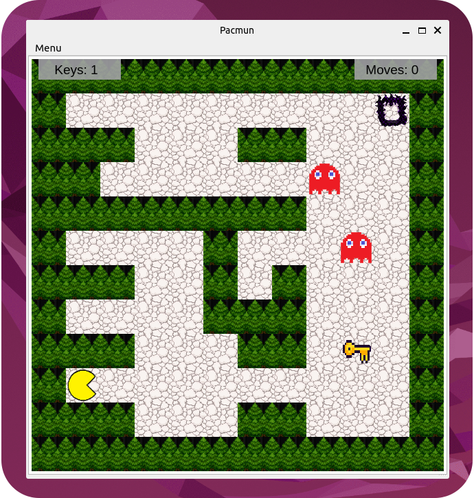

# PacmanICP - Pseudo Pacman in C++ (QT)

## Team
- Tomas Behal `xbehal02`
- Jakub Kontrik `xkontr02`

## Usage
- `make build` - build project
- `make run` - build and run project
- `make doxygen` - generate documentation

## Structure
`ICP-Project`\
  |-- `doc/` - documentation\
  |-- `examples/` - map examples\
  |-- `replays/` - replay examples\
  |-- `src/` - source files\
  |  |-- `backend.cpp` - backend functions and map control\
  |  |-- `gameover_scene.cpp` - game over window\
  |  |-- `gamestate.cpp` - game scene\
  |  |-- `ghost.cpp` - ghost class\
  |  |-- `key.cpp` - key class\
  |  |-- `main_scene.cpp` - map and counters display\
  |  |-- `main.cpp` - main function\
  |  |-- `mainwindow.cpp` - UI, necessary objects\
  |  |-- `map_object.cpp` - map objects\
  |  |-- `map.cpp` - reads map from input\
  |  |-- `pacman.cpp` - pacman class\
  |  |-- `replay.cpp` - replay handling\
  |-- `textures/` - images for objects\
  |  |-- `ghosts/` - Ghost files\
  |  |-- `misc/` - Misc files\
  |  |-- `pacman/` - Pacman files\
  |-- `Doxyfile` - doxygen configuration file\
  |-- `Makefile` - makefile for building project\
  |-- `README.md` - this file

## Functionality
- Default map is loaded from `examples/map-01.txt`
- Map can be loaded via `Menu -> Maps` from `examples/` folder
- Pacman moves via W-A-S-D and arrow keys
- Walks in given direction until it hits a wall
- Ghosts move randomly without stopping
- Pacman needs to collect all keys to open target gate
- Player wins when he collects all keys and reaches the gate
- Player loses when he gets caught by a ghost
- Player can save his game replay and walk it through
- Replays can be loaded via `Menu -> Replays` from `replays/` folder
- Rewriting replay files is not recommended

## Known missing functionality (might be added in a free time)
- Pacman movement with `mouse clicks`
- `Play`, `Pause`, `Rewind` buttons for replay
